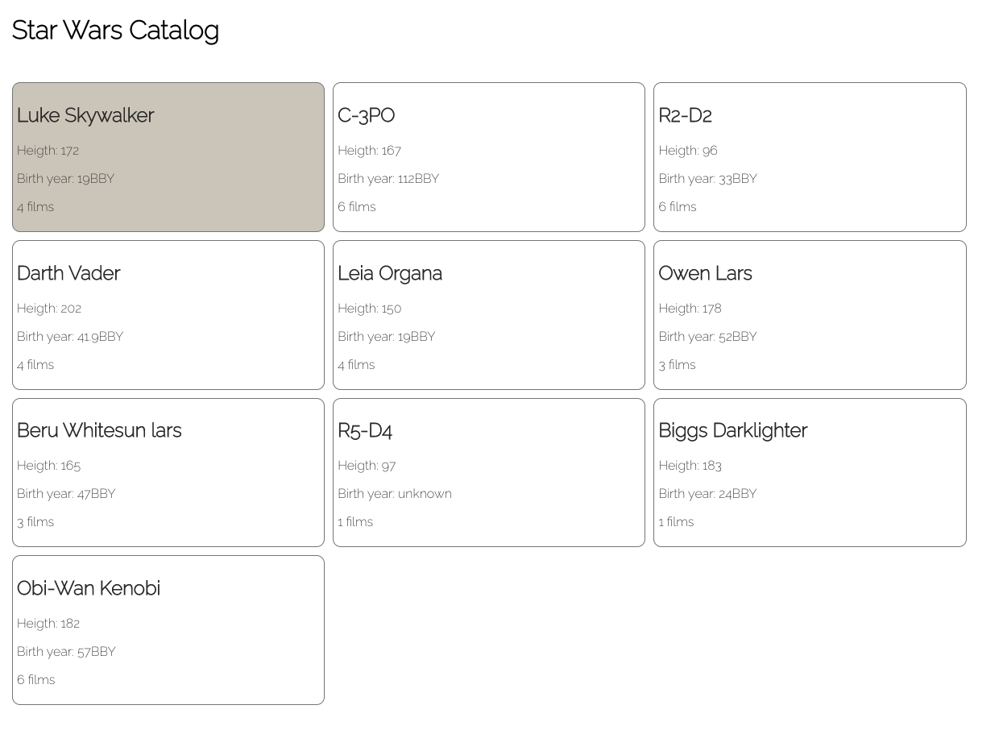
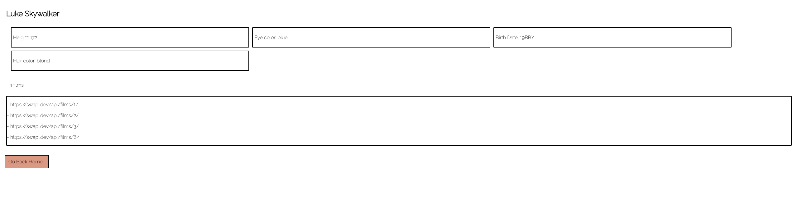

## Catalog_Star_Wars

Build a web application to show a catalog of the Start Wars characters

[Olga Nedelcu](mailto:olga@codewithdragos.com)

## Assumptions

- Catalog Home Page
- Card character Page
- Loading Botton to fetch more Character's cards

## Proposed Solution

- Create a component called CatalogPage that will be the HomePage for our catalog
- Create a component for each Character Card fetching the API to get the char name, birth year...
-  (Optional) Create a component that returns a button to fetch more Character Cards to the HomePage that'll is put together in App.jsx

## Screenshots

## 

## Libraries / Tools Used

- React.js
- Create React App for project setup
- For testing use Cypress
- Styled react components
- Netlify to deploy the catalog

## Setup

To install the dependencies run:

`npm install`

And to run the app:

`npm start`

### Running the tests

- cy:open 

#### Unit Tests

You can run the unit tests using:

`npm test`

#### Integration Tests

To run Cypress in interactive mode run:

`npm run cy:start`

# catalog-star-wars
